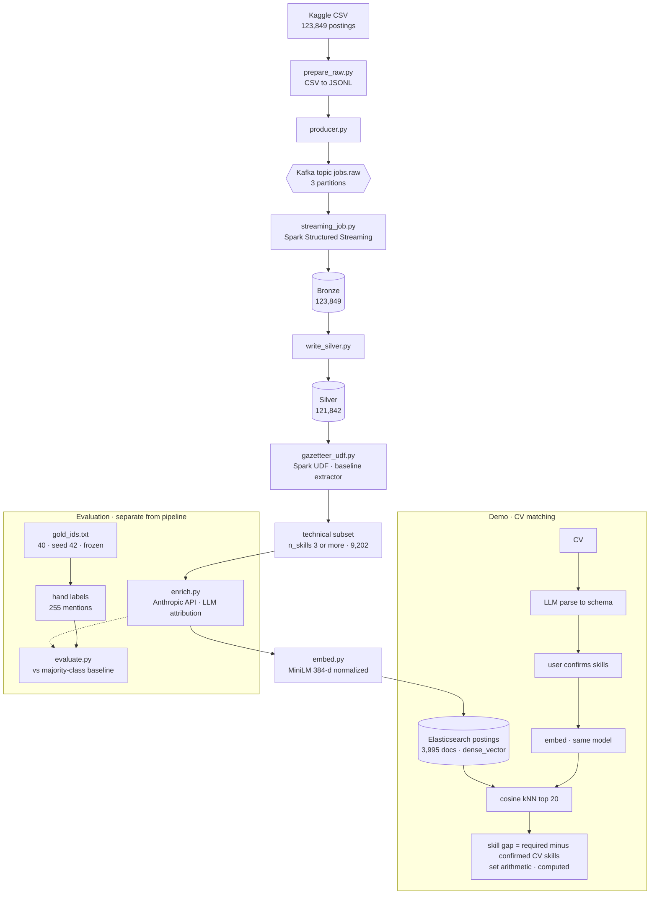

# AI-Powered Job Market Intelligence & Semantic CV Matching
### Design document — Big Data and AI course project

**Problem.** Job postings state requirements in inconsistent free text. Keyword search can tell
that a posting *mentions* a technology, but not *why* it appears — whether it is required, merely
preferred, part of the company's self-description (boilerplate), or explicitly not expected. That
distinction is what makes a posting matchable to a candidate, and it is what keyword extraction
cannot recover. This pipeline extracts each technology mention *with its attribution*, evaluates
that against a keyword baseline, and uses the result to match a CV to postings and compute the
missing required skills.

**Dataset.** ~124k LinkedIn job postings (Kaggle, `arshkon/linkedin-job-postings`), 493 MB CSV.
The graded input is the free-text `description` field. Sample: `docs/sample_postings.jsonl`.

---

## Architecture

---

## Data flow

1. **Ingest.** `prepare_raw.py` converts the source CSV to JSONL (format only, no logic).
   `producer.py` publishes 123,849 records to the Kafka topic `jobs.raw`.
2. **Bronze → Silver (Spark).** `streaming_job.py` reads the topic with Structured Streaming and
   writes an untouched Bronze layer (123,849 rows). `write_silver.py` applies the cleaning
   funnel — drop blank descriptions, a language filter, a minimum length — leaving 121,842 rows
   (1.62% loss). Deduplication was *measured* (0 duplicate job IDs) and therefore not executed.
3. **Gazetteer (Spark UDF).** `gazetteer_udf.py` matches a 111-technology gazetteer over every
   Silver row and writes `skills_gazetteer` and `n_skills`. This is simultaneously the
   deterministic **baseline extractor** and the study-population filter.
4. **Technical subset.** Postings with three or more gazetteer terms (9,202; 7.6% of the corpus)
   define the technical population; 4,000 are sampled for enrichment.
5. **LLM enrichment.** `enrich.py` calls the Anthropic API on each sampled description and returns,
   per technology, an attribution class and a verbatim evidence span. 3,995 of 4,000 succeeded.
   The output is validated (below), never trusted.
6. **Embeddings + index.** `embed.py` encodes *title + extracted skill names* with MiniLM (384-d,
   normalized). `index_to_es.py` — the sole Elasticsearch writer — loads 3,995 documents into the
   `postings` index under an explicit `dense_vector` mapping.
7. **Demo.** A CV is parsed to the same schema, the extracted skills are confirmed by the user,
   the text is embedded with the same model, and postings are retrieved by cosine kNN. The skill
   gap is `posting.skills_required − confirmed_cv_skills` — set arithmetic, computed, not generated.

---

## Technologies (four course technologies used; the stated minimum is one)

| Technology | Role |
|---|---|
| **Docker** | Kafka and Elasticsearch run as containers via Compose. |
| **Apache Kafka** | Ingestion transport; paced replay of the corpus into `jobs.raw`. |
| **Apache Spark** (Structured Streaming) | Reads Kafka, writes the Bronze/Silver medallion layers, runs the gazetteer as a UDF over all rows. |
| **Elasticsearch** | Document store and vector index; explicit mapping, `dense_vector` kNN, `dynamic: strict`. |

Spark runs on the host in `local[*]` and writes Parquet only. Elasticsearch is written exclusively
by `index_to_es.py`, which avoids the `elasticsearch-hadoop` connector-JAR version-matching trap.

---

## AI capability (the graded component)

Two of the brief's options, integrated into the pipeline: **LLM-based enrichment as a
transformation step** (§6.2a) and **embeddings + semantic search** (§6.2b).

The graded contribution is the enrichment. For each technology mention the LLM assigns one of four
classes — *required / preferred / boilerplate / not_expected* — with a mandatory verbatim evidence
span. The research question is whether the LLM recovers *why* a skill is mentioned more accurately
than a keyword baseline, which must treat every match as "required."

**Validation chain — the output is validated, never trusted:**

1. **Pydantic**, `extra: forbid`, `Literal` on the class — an unexpected field or a mis-capitalised
   class fails rather than being silently accepted.
2. **Grounding** — the evidence span must appear in the source description (compared
   whitespace-stripped, because the corpus contains fused words from HTML tags removed without
   substitution). 99.1% of 55,088 corpus mentions grounded.
3. **One retry, then drop and log.**

**Computed vs generated is explicit throughout.** `skills_gazetteer` (deterministic matching) and
the skill-gap set difference are *computed*. The four `skills_required / skills_preferred /
skills_boilerplate / skills_not_expected` arrays are *generated*, validated, and named to expose
the boundary. The optional advice panel in the demo is generated and shown in a visibly separate,
labelled region.

---

## Results (observations about this dataset — not claims about the labour market)

Evaluated on a frozen gold set of 40 postings (255 hand-labelled mentions; IDs fixed by seed before
any prompt existed, with prompt iteration confined to a disjoint 10-posting dev set). On mentions
detected by *both* systems, the LLM attributed correctly **87.3% (200/229)** against a
majority-class baseline of **76.4% (175/229)**. These figures are indicative, not precise: n=40,
and mentions within a posting are not independent, so the true confidence interval is wider than a
naive binomial.

---

## Key trade-offs

- **Gold universe bounded to the gazetteer** — hands perfect detection recall to the baseline by
  construction; conservative in the direction that would undermine our own claim.
- **Kafka replay, not live scraping** — stated honestly; a live source adds a day for no extra grade.
- **Embed title + skills, not the full description** — MiniLM truncates at 256 word-pieces and the
  median description is 477 words, so retrieval depends on extraction quality. Stated as a limitation.
